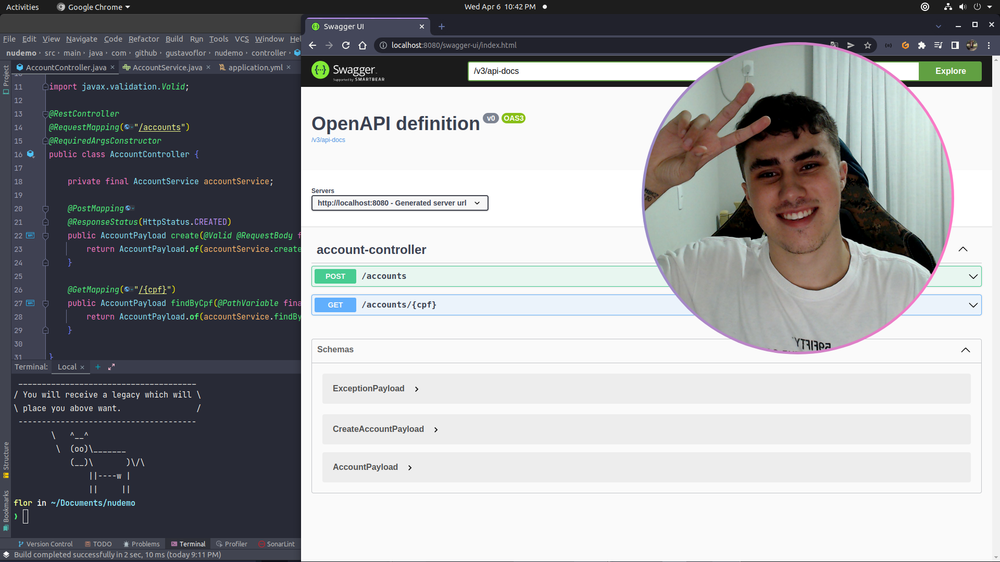

```diff
Hello, welcome to my Github, you can call me as Flôr 💻.

@@I'm a software engineer@@

+ I live in Joinville 🇧🇷
- I'm 20 years old
! Studying Java, NodeJS and React Stack
```

<br>

Hey, I'm so happy that you're reading this, regards!

On this place you'll found some of my personal ~unfinished~ projects, I like to think in something and put it in practice just to learn and try to put this learns in my job routine, so if you saw something that you like feel free to contribute.


# Need a Software Engineer? [**Talk with me**](https://www.linkedin.com/in/gustavoflor/)



---

### 10 nonsense (or not) facts about me:

1. I'm reading now: Clean Code
2. I used to play basketball for my hometown city (Joinville)
3. I love games, nowadays I'm playing Valorant (but this doesn't mean I'm not a noobie)
4. I'm studying a second language (English), so my bad if I wrote something wrong hehe
5. My girlfriend broke my finger on our first date
6. I'm starting play a RPG game called "Ordem Paranormal" with a friend
7. PIZZA IS LIFE
8. I've tattooed a cat with 3 eyes in my shin
9. My friends call my as "Canela" is the same as "Shin", but in Brazil "Canela" should be "Cinnamon" too (and that's funny in some cases)
10. I like to record some videos to YouTube ~and I need to do it more~ 
11. PLUSSSSS: I love nonsense socks and love shuffle then, so if you come to my home I'll be using a pink eggs sock in one foot and a yellow cactus sock on another

> Live your truth

